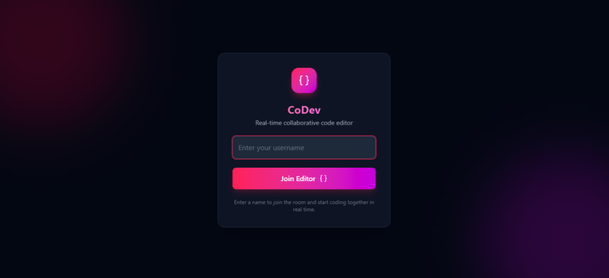
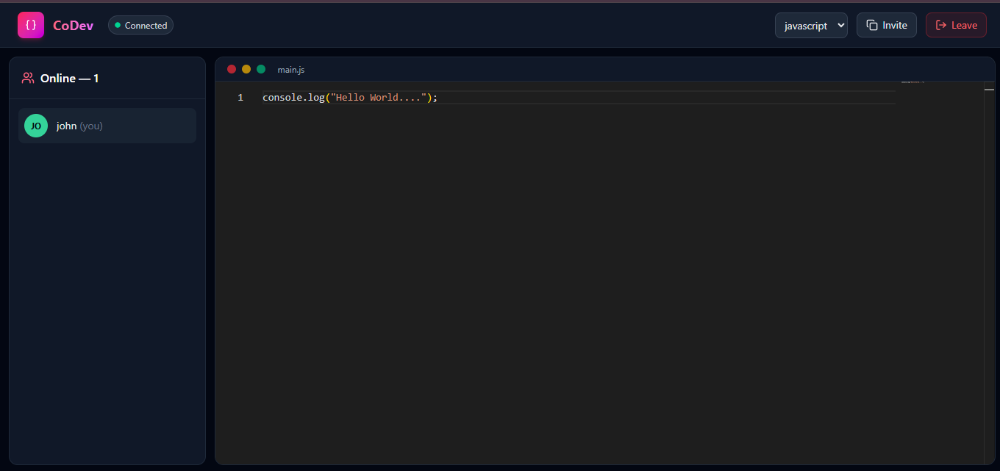

# 🚀 CoDev - Real-time Collaborative Editor

**CoDev** is a real-time collaborative code editor that allows multiple developers to work on the same code simultaneously - similar to the collaborative experience of Google Docs, but built specifically for code.

It uses **Yjs CRDTs** to maintain consistent shared state and automatically resolve editing conflicts, while **WebSockets** enable real-time communication and synchronization between connected users.

---

## ✨ Features

* 👥 **Real-time Collaboration**
  Multiple developers can edit the same code simultaneously.

* ⚡ **Real-time Synchronization**
  Changes are instantly synchronized between connected clients using WebSockets.

* 🧩 **Conflict-free Editing**
  Powered by **Yjs CRDTs**, allowing concurrent edits without manually handling conflicts.

* 🖥️ **Monaco Code Editor**
  Uses the same powerful editor technology behind VS Code.

* 🔄 **Automatic State Synchronization**
  Shared document state stays synchronized across multiple users.

* 🎨 **Modern UI**
  Built with React and Tailwind CSS.

* 🔌 **WebSocket-based Communication**
  Socket.IO and Y-Socket.IO are used for real-time collaboration.

---

## 🛠️ Tech Stack

### Frontend

* React 19
* Vite
* Monaco Editor
* Yjs
* Y-Monaco
* Y-Socket.IO
* Socket.IO Client
* Tailwind CSS
* Lucide React

### Backend

* Node.js
* Express.js
* Socket.IO
* Y-Socket.IO

### Core Concepts

* **CRDTs (Conflict-free Replicated Data Types)**
* **Real-time WebSocket Communication**
* **Collaborative State Synchronization**

---

## 🏗️ How It Works

CoDev uses **Yjs**, a CRDT-based library, to maintain a shared document between multiple users.

A simplified architecture looks like this:

```text
              ┌─────────────────────┐
              │      Developer 1    │
              │   Monaco Editor     │
              └──────────┬──────────┘
                         │
                         │
                  Yjs / WebSocket
                         │
                         ▼
              ┌─────────────────────┐
              │    Node.js Server   │
              │  Socket.IO + Yjs    │
              └──────────┬──────────┘
                         │
                  Yjs / WebSocket
                         │
                         ▼
              ┌─────────────────────┐
              │      Developer 2    │
              │   Monaco Editor     │
              └─────────────────────┘
```

When one developer makes a change:

```text
Developer 1
     │
     ▼
Monaco Editor
     │
     ▼
Yjs Document
     │
     ▼
WebSocket
     │
     ▼
Node.js Server
     │
     ▼
Other Connected Clients
     │
     ▼
Yjs resolves/synchronizes changes
```

Because Yjs uses **CRDTs**, concurrent changes can be merged without relying on a traditional last-write-wins approach.

---

## 🧠 Why CRDTs?

In a normal collaborative editor, two users modifying the same document at the same time can create conflicts.

For example:

```text
User A → const name = "Nikita";
User B → const name = "Developer";
```

If both changes happen concurrently, the application needs a strategy to determine how those changes should be merged.

CoDev uses **Yjs CRDTs** to handle concurrent modifications and keep replicas of the shared document synchronized.

This makes collaborative editing much more reliable without requiring a central system to manually resolve every conflict.

---

## 📁 Project Structure

```text
CoDev/
│
├── frontend/
│   ├── src/
│   ├── public/
│   ├── package.json
│   └── vite.config.js
│
├── backend/
│   ├── server.js
│   └── package.json
│
└── README.md
```

---

## ⚙️ Installation & Setup

### 1. Clone the Repository

```bash
git clone https://github.com/nikitatale/CoDev.git
```

```bash
cd CoDev
```

---

### 2. Setup Backend

```bash
cd backend
```

Install dependencies:

```bash
npm install
```

Start the development server:

```bash
npm run dev
```

The backend server will start on the configured port.

---

### 3. Setup Frontend

Open another terminal:

```bash
cd frontend
```

Install dependencies:

```bash
npm install
```

Start the Vite development server:

```bash
npm run dev
```

Open the URL provided by Vite in your browser.

---

## 📦 Available Scripts

### Frontend

```bash
npm run dev
```

Starts the Vite development server.

```bash
npm run build
```

Creates a production build.

```bash
npm run lint
```

Runs ESLint.

```bash
npm run preview
```

Previews the production build locally.

### Backend

```bash
npm run dev
```

Starts the backend using Nodemon.

```bash
npm start
```

Starts the backend using Node.js.

---

## 🔑 Core Technologies Explained

### Monaco Editor

CoDev uses **Monaco Editor** to provide a powerful browser-based coding environment with features similar to modern desktop code editors.

### Yjs

**Yjs** is used as the shared document model. It provides CRDT-based synchronization so multiple clients can modify the same document concurrently.

### Y-Monaco

**Y-Monaco** connects the Yjs shared document with the Monaco Editor, allowing editor changes to be synchronized through the shared Yjs state.

### WebSockets

WebSocket-based communication allows changes to travel between connected clients in real time.

CoDev uses:

* Socket.IO
* Y-Socket.IO

to support real-time communication and synchronization.

---

## 🎯 Learning Goals

This project was built to understand and implement:

* Real-time collaboration
* WebSocket communication
* CRDTs
* Distributed state synchronization
* Conflict-free concurrent editing
* Monaco Editor integration
* React application architecture
* Client-server communication

---

## 🚀 Future Improvements

Some features that can be added in future versions:

* 🔐 User authentication
* 👤 User presence indicators
* 🟢 Online/offline status
* 🖱️ Collaborative cursors
* 🎨 Different user cursor colors
* 📂 Multiple files and folders
* 🏠 Workspace/room-based collaboration
* 💾 Persistent document storage
* 🌓 Dark/light theme
* ▶️ Code execution
* 💬 Real-time collaboration chat
* 📜 Version history
* 🔗 Shareable collaboration links

---

## 📸 Screenshots





---

## 🤝 Contributing

Contributions, issues, and feature requests are welcome.

Feel free to fork this repository and submit a pull request.

---

## 👩‍💻 Author

**Nikita Tale**

Learning and Exploring real-time collaborative systems.

---

## ⭐ Show Your Support

If you found this project interesting, consider giving it a ⭐ on GitHub!
